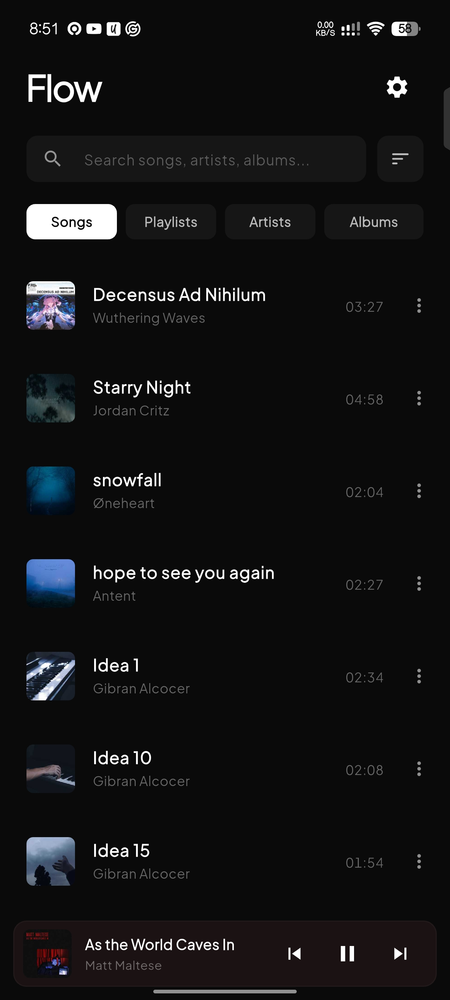
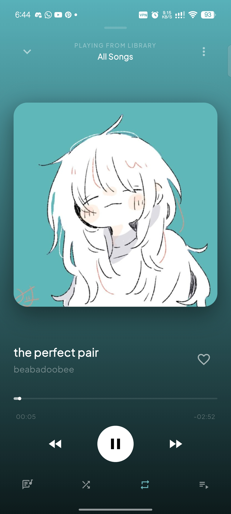
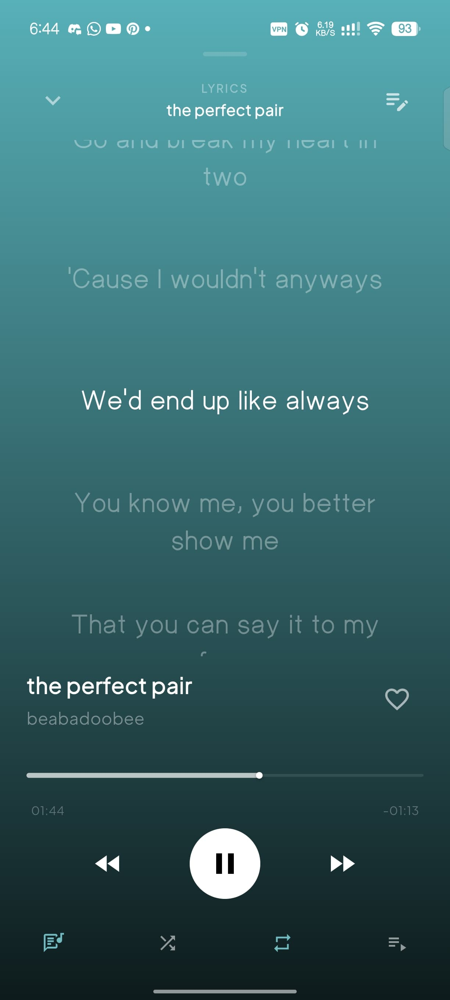
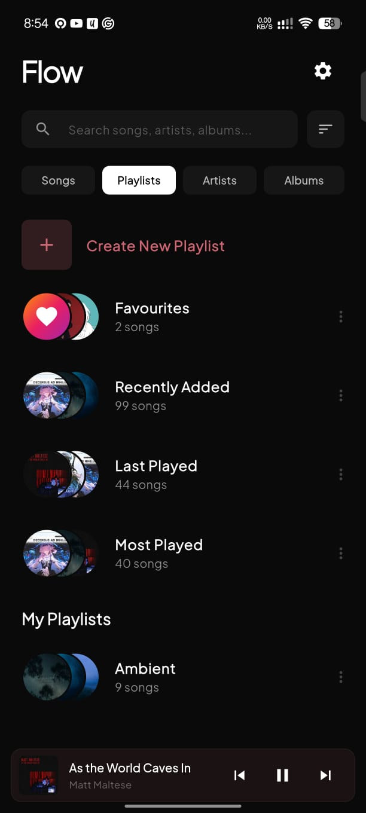
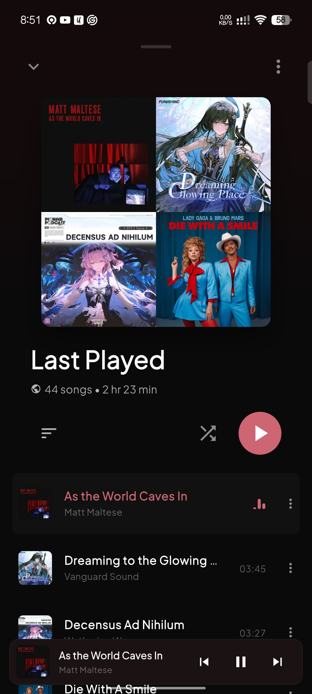
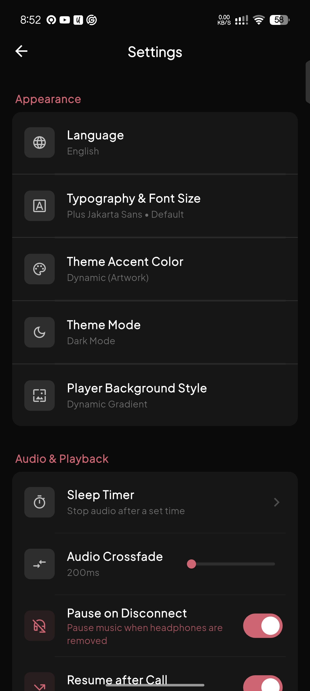

# Flow Audio Player

Flow is a modern, feature-rich local audio player built with Flutter. It focuses on providing a premium listening experience with a clean user interface, seamless background playback, and smart track management.

## Previews

  
  
  

  
  
  

## Features

- **Local Audio Scanning**: Automatically queries and fetches audio files from scoped device storage with reactive permission controls.
- **Smart Playlists Engine**: Dynamically aggregates tracks into _Favourites_, _Recently Added_, _Last Played_, and _Most Played_ lists based on secure play statistics.
- **Background Playback**: OS-level backgrounding service with system notifications, lock screen media controls, and native audio sessions.
- **Adaptive Aesthetics**: Spotify-like dynamic background color extraction from album art using `palette_generator`, painting beautiful rich linear gradients.
- **Custom Player Background Styles & Real-Time Wallpaper Editor**: Support for four breathtaking Now Playing rendering modes: **Dynamic Gradient** (color extracted linear blend), **Apple Blurred Cover** (clean, high-fidelity glassmorphic overlay powered by an optimized hardware-accelerated `ImageFiltered` widget wrapped inside a precise `ClipRect` to prevent bleeding), **AMOLED Deep Black** (pure solid black for visual minimalism and battery saving), and **Custom Gallery Image** (pick any custom photo from your device gallery). Features a **real-time wallpaper editor** under Settings to adjust **Blur Level (0-60)**, **Dim Level (0-90%)**, and **Zoom Scale (1.0x-3.0x)** with an interactive miniature live mockup preview!
- **Global 3-Choice Theme Modes**: Rich selection between:
  - **Dark Mode**: Sleek, battery-saving dark theme (`#0A0A0A` scaffold, `#161616` cards).
  - **Light Mode**: Gorgeous, clean light theme (`#F6F8FA` scaffold, `#FFFFFF` cards).
  - **Custom Theme Mode**: High-fidelity theme customizer supporting a glowing **Dynamic (Artwork)** background (which automatically extracts and tints the entire app backdrop using an HSL mathematical safety algorithm), **5 Luxury Solid Color Backdrops** (Deep Navy, Forest Green, Midnight Wine, Sunset Terracotta, Slate Gray-Blue), or **Custom Gallery Image Wallpaper** (pick any custom photo from your device gallery). The entire application UI—including scaffold backdrops, list cards, settings cards, typography colors, action icons, chevrons, and submenus—instantly adapts with premium responsiveness. Features a **real-time theme wallpaper editor** inside the Settings panel to customize **Blur Level (0-60)**, **Dim Level (0-90%)**, and **Zoom Scale (1.0x-2.0x)** with an interactive live miniature replica mockup card of the Library Home Screen!
- **Dynamic Theme Accent Customization**: High-fidelity custom accent preset selector with 9 premium solid presets (Spotify Green, Apple Red, Deep Purple, Tidal Cyan, Sunset Orange, Sakura Pink, Luxury Gold, Sapphire Blue, Electric Lime) or **Dynamic (Artwork)** color matching.
- **HSL Contrast Safety (Auto-Brightener)**: Real-time mathematical luminance safety interceptor that automatically boosts dark extracted cover art colors into readable pastels/neons, mapping pure black/desaturated covers to a sleek, premium Silver-Grey.
- **ValueNotifier Real-Time State Sync**: Continuous visual color stream coupling that propagates theme modifications and cover artwork changes instantly across all pushed settings panels, switches, and sliders in real-time.
- **Interactive Lyrics Engine**: Synced LRC & plain text support with zero truncation. Renders dynamic word-wrapping karaoke streams styled perfectly to Flow's custom fonts without cutting off text.
- **Dynamic Sleep Timer**: Automatically stop audio playback with built-in presets (15m, 30m, 60m) or custom inputs, complete with a live counting indicator on the player header.
- **Precision Audio Transitions**: Custom Crossfade adjustments (0ms to 3000ms) with a 150ms fade-in/fade-out playing transition to avoid pops/crackles.
- **Auto Regex Cleaner**: An aggressive, native RegExp title cleaner that removes underscores, empty brackets, and cluttered suffixes (like `4K Remastered`, `Official Video`, `Remastered`).
- **Dynamic Artist Extraction**: Automatically parses song titles to extract and populate missing artist fields when the local file's metadata tags are empty or unrecognized.
- **Virtual Metadata Editor**: Edit song Titles, Artists, and Albums virtually inside the app interface without touching the physical source files.
- **Custom Covers & Art**: Select custom images from your device gallery to personalize custom playlists or override standard album covers.
- **Dynamic Durations & Equalizers**: Formatted track durations are beautifully shown next to song lists, which seamlessly transform into live-animated `MiniMusicVisualizer` equalizers when tracks are actively playing.
- **Pixel-Perfect Margin Alignment**: Custom spatial translations (`Transform.translate`) align song controls and durations at a precise `24px` horizontal screen margin, perfectly lining up with page pills, search headers, and playlist card boundaries.
- **Search & Navigation**: Easily query tracks, artists, or albums and navigate through horizontal swipable tabs.

## What's New

- **App Data Backup & Restore Engine**: Introduced a robust, localized Backup and Restore system within the Settings under "Library & Storage". Users can now safely export a `Flow_Backup.json` file directly to their Downloads folder, safeguarding all play statistics, custom playlists, favorited tracks, hidden tracks, and personalized theme configurations. The Restore engine intelligently matches existing tracks by ID upon import, safely bypassing missing/deleted tracks without crashing, enabling seamless device migration!
- **Universal Action Confirmations**: Implemented a globally cohesive, theme-responsive confirmation dialog system for all destructive actions. Users are now securely prompted before triggering irreversible actions like Deleting Tracks from the Device, Removing Custom Playlists, Backing Up data, Restoring archives, or Resetting all App Data, providing a safety net for accidental taps.
- **Dynamic Tab Re-Animation & Jitter-Free Scrolling**: Overhauled the PageView tab switcher to intelligently monitor and rebuild animation states in real-time. Fixed a critical "flickering refresh" issue during horizontal page swipes by decoupling the state clearing logic into direct pill interaction events. Furthermore, stabilized the staggered animation engine to properly handle rapid scrolling scenarios without canceling or abruptly snapping animation frames.
- **Silent Background Artwork Preloader**: Engineered a custom `ArtworkCacheManager` that silently pre-fetches and loads all audio thumbnails into memory immediately after the app starts. Both native MediaStore thumbnails and user-selected custom covers are pre-loaded (using native `ImageCache` pre-resolution to guarantee minimal RAM usage for custom heavy files). Scrolling down the library list is now incredibly buttery smooth and 100% instant, eliminating any black/gray flashes or loading UI states on first view!
- **Universal & Deep Localization Coverage (EN/ID/JA)**: Permeated dynamic localization throughout every hidden corner of the application—including search bar placeholders, track option submenus ("Go to Album", "Go to Artist", "Song Info", "Hide from Library", "Delete from Device"), and the entire "Create/Rename Playlist" flows. Includes full Indonesian and Japanese support for all 7 song sorting modes!
- **Flawless Zero-Issue & Zero-Warning State**: Cleaned up strict constant expression compiler errors (`const_eval_method_invocation`) across `settings_modals.dart` and `settings_screen.dart`, fixed syntax and token parsing errors in playlist creation dialog toast, and achieved a pristine, warning-free compiler build with `No issues found!` under `flutter analyze`.
- **Dynamic Lyrics & Theme Adjustments**: Fixed a text-clipping bug on the 3rd line of synced lyrics by safely expanding the `itemHeight` and shrinking internal vertical padding. Additionally, configured the Custom Theme Image background to automatically hide when opening Album Detail Views, guaranteeing clear text visibility against album covers while keeping the custom theme fully active underneath.
- **Static App Header**: Locked the top header text to cleanly read "Flow" across all navigation tabs, minimizing unnecessary visual changes during page navigation.
- **Flawless UI State Synchronization**: Fixed a deep state-shadowing bug where editing track metadata (Titles, Artists, or Custom Covers) via the `StatefulBuilder` modal failed to trigger a rebuild on the root `main.dart` scaffold. Now, modifying any track metadata instantly propagates changes across the entire app—including the main Songs list, Mini Player, and Full Screen Player—in real-time without requiring an app restart.
- **Dynamic Artwork Memory Cache Engine**: Rewrote the core `CachedTrackArtwork` renderer to correctly invalidate old in-memory image buffers (`_bytes`) when a user uploads a new custom cover image. Custom high-res covers now instantly replace native `MediaStore` thumbnails across all list views, completely solving stubborn cache issues.
- **Optimized Background Blur Performance**: Drastically improved the UI rendering speed of Album and Playlist Detail Views when viewing tracks with massive custom images. The high-fidelity `ImageFiltered` background blur effect now intelligently utilizes a pre-resolved, low-resolution thumbnail (`cacheWidthOverride: 144`) instead of forcing the UI thread to perform a 45px Gaussian Blur on a massive 600px+ image, completely eliminating scroll lag and frame-drop flickering.
- **Zero-Jank Settings Real-Time Sync**: Fixed a massive performance bug where toggling any setting (like Crossfade, Silence Trimmer, or Pause on Disconnect) incorrectly triggered a full file-system scan of the entire device library. The `SettingsScreen` architecture was refactored with a dedicated `onSettingsChanged` callback. Now, audio settings update the main application state and the playback engine in true real-time, instantly and silently.
- **Artwork Race Condition Mitigation**: Solved a classic threading issue causing the first 3 tracks in the Library list to permanently render with missing album covers upon launching the app. Engineered an `_inFlight` Future mapping registry in the `ArtworkCacheManager` to elegantly block simultaneous native platform channel queries (from the UI and background preloader). It now strictly fetches the native artwork only once and distributes the exact same resolved `Future` across all callers concurrently.
- **Fast-Switching Playback Race Condition Fix**: Completely eradicated a major playback bug where rapidly tapping multiple songs before they finished buffering would cause the player to "rubberband" and play the older song. Implemented a robust `_playRequestId` locking mechanism inside the core `_playTrack` logic. Stale asynchronous requests are now instantly intercepted and aborted, guaranteeing that the audio engine strictly plays the absolute latest user selection.
- **Detail View Animation & Cache Stabilization**: Fixed an intrusive UI bug where the songs inside an Album/Playlist view would erroneously replay their entrance animations every time a new track started playing due to dominant color cache invalidation. Implemented a dual-key caching system (`_cachedDetailBaseKey`) to accurately distinguish between content updates and background color updates. Furthermore, the `_FadeInSlideUp` animations were intentionally disabled entirely for all list items within Detail Views to guarantee a much snappier, instant-load user experience when browsing albums and playlists.
- **Instant Metadata Sync Engine**: Overhauled the core metadata editing architecture to broadcast changes instantaneously. When saving custom ID3 tags/metadata natively, the newly modified track data is now dynamically injected straight into the live `_playbackQueue` and the background service's `AudioHandler.mediaItem`. This strictly eliminates any lag, ensuring the Android Lock Screen, System Notification, and in-app Full Screen Player immediately reflect real-time title/artist updates without forcing the user to reload the active track!
- **Active State Dot Indicators**: Upgraded the Full Screen Player's bottom control bar (Lyrics, Shuffle, Repeat) with premium visual feedback. When toggled, active icons now display a precise, colored circular dot indicator (`4x4` pixel `BoxShape.circle`) nested seamlessly within a `Stack` hierarchy beneath them. This guarantees high accessibility and clear visual distinction between active and inactive states, even when the dynamically extracted theme accent color happens to be pure white against a light background!
- **Detail Header & Cover Polish**: Refined the UI presentation of the Album and Playlist Detail View headers. The "Chevron" back button and "More Options" 3-dot indicator have been spatially aligned with wider margins (`Transform.translate`), pushed cleanly upwards against the pill handle, and injected with subtle transparency (`alpha: 0.5`) to seamlessly blend over rich background gradients. Additionally, scaled up the primary Album Cover and Grid Covers from `290x290` to a much larger and immersive `300x300` resolution. Artist covers (both in the Library List Tab and Detail View) have been fundamentally redesigned to discard their legacy circular cropping (`radius: 22` / `radius: 145`) in favor of a modern, unified rounded-square aesthetic (`radius: 6` / `radius: 12`) matching the Album grid standards for absolute visual consistency.

## Previous Updates

- **Massive Modular Architecture Refactoring**: The Flow codebase has been completely deconstructed from monolithic "God Objects" into a clean, highly modular structure. The `main.dart` entrypoint was dramatically reduced from over 3,200 lines to under 700 lines by extracting core UI components and heavy audio state management into `lib/ui/main_ui_components.dart` and `lib/logic/main_audio_logic.dart`. Furthermore, massive UI files like `modals_ui.dart` and `settings_screen.dart` were systematically split into specialized, domain-focused modules (Track, Playlist, Utility Modals, and isolated Settings components) using a scalable `part` and `extension` architecture. This guarantees incredible maintainability, lightning-fast IDE indexing, and a pristine separation of concerns without sacrificing state synchronization!
- **Advanced Metadata & Cover Editor**: Enhanced the Edit Metadata functionality to support custom covers for Albums and Playlists (including Smart Playlists like Most Played). Users can now select custom cover art from their device gallery or pick the cover art of an existing song in their library. Artwork fetched from other songs is extracted at high-resolution (1000px) to prevent pixelation. Furthermore, all dynamic color player backgrounds (`PaletteGenerator`) now instantly update in real-time when the current track or album's cover is changed without needing to close the player. Also refactored the Detail Options modal into a fully scrollable view with secured context-mounted callbacks for flawless interactions.
- **Draggable Up Next Queue**: Upgraded the "Up Next" queue modal from a static list to an interactive `ReorderableListView`. Users can now intuitively drag and drop tracks to rearrange the upcoming playback order. The logic is deeply integrated with the core audio engine, meaning changes instantly sync with both sequential and shuffled playback modes (`ConcatenatingAudioSource`) without interrupting the currently playing song. The currently playing track is intelligently locked in place to prevent accidental playback disruptions.

## Project Structure

The project has been refactored into a highly modular, decoupled architecture using Dart's `part` and `part of` directives, keeping local state synchronization lightweight and seamless:

- **`lib/main.dart`**: Root application entry, boot sequence initialization, and core Scaffold state container. Now elegantly stripped of massive logic blocks for a clean ~700 line entrypoint.
- **`lib/logic/main_audio_logic.dart`**: The brain of the application. Houses all complex state mutations, audio streaming integrations, dynamic lyric fetching, crossfade lifecycle management, and playback queue transformations.
- **`lib/ui/main_ui_components.dart`**: Core skeletal UI renderers extracted from the main tree, including custom headers, empty states, and dynamic playlist grid covers.
- **`lib/ui/player_ui.dart`**: Fullscreen adaptive music player UI. Houses physics-based swipe-down gestures, sliding mini players, and dynamic palette-based gradients.
- **`lib/ui/detail_views_ui.dart`**: Dynamic detail overlays for Artists, Albums, and custom/default Playlists.
- **`lib/ui/tabs_ui.dart`**: Viewport page layouts hosting horizontal swipable tabs (Songs list, Playlist cards, Artist list, Album cards) and the standard search system.
- **`lib/ui/modals_track_ui.dart` / `modals_playlist_ui.dart` / `modals_utility_ui.dart`**: Highly specialized, domain-driven modal architectures for handling track operations, robust playlist CRUD, and utility tools (Sleep Timer, Equalizer, Folder Scans).
- **`lib/screens/settings_screen.dart` & `settings_modals.dart`**: A standalone, polished Material 3 settings hub entirely decoupled from monolithic implementations, utilizing isolated component builders and dedicated modal controllers.
- **`lib/services/audio_handler.dart`**: OS-level audio intent interception and background service hooks (`MyAudioHandler`).
- **`lib/utils/globals.dart`**: Centralized dependency injection for global state `ValueNotifiers`, theme configuration tools, and app-wide Toast notification helpers.

## Dependencies

- **`just_audio`**: High-performance local and streaming audio playback engine.
- **`audio_service`**: OS-level audio session backgrounding and system tray locking controls using MediaSession APIs.
- **`on_audio_query`**: Scoped querying of local media storage structures.
- **`permission_handler`**: Runtime operating system authorization checks (Storage/Notification).
- **`shared_preferences`**: Local key-value state persistence (play count, custom playlists, settings).
- **`google_fonts`**: Premium text styles and typography integration.
- **`mini_music_visualizer`**: Real-time visual music playing equalizer bars.
- **`fluttertoast`**: Non-blocking platform native alert toasts.
- **`palette_generator`**: Extraction of dynamic dominant palette colors from album art.
- **`image_picker`**: Device photo gallery selection utilities.
- **`audio_session`**: Native platform hardware-level audio session interrupt binds.
- **`url_launcher`**: Intent dispatching to external links (GitHub / Sociabuzz).

## Build Requirements

- **Android**: Requires `minSdk` 21, `targetSdk` 34 (or higher), and Java 17 for compilation. Note that the project utilizes Flutter's Built-in Kotlin compatibility.

## Development Notes

- When running on Android 13 or higher, ensure that the application is granted the `READ_MEDIA_AUDIO` permission for proper library scanning. The application uses `content://` URIs to support scoped storage natively.
- Make sure to use JDK 17 for compiling the Android build due to updated Kotlin and Gradle Plugin (`build.gradle.kts`) requirements.

## License

This project is licensed under the GNU General Public License v3.0 (GPL-3.0). See the [LICENSE](LICENSE) file for more details.
